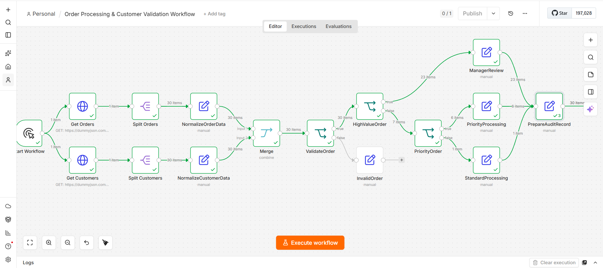
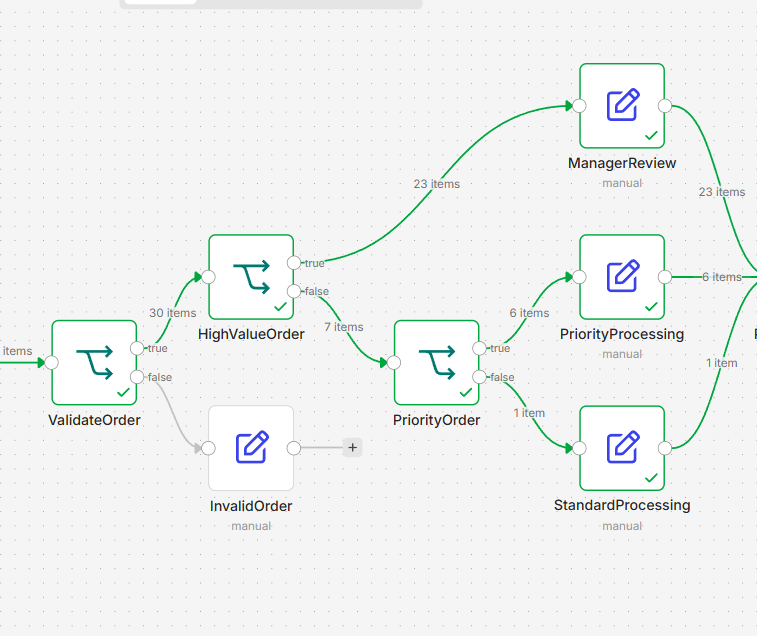
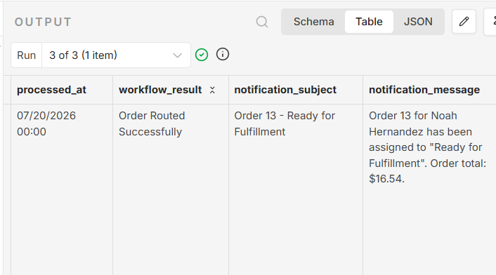

# Automated Order Processing & Customer Validation Workflow



> An end-to-end order processing automation workflow built with n8n featuring API integration, customer data enrichment, business rule routing, validation, and audit record generation.

---

## Overview

This project demonstrates an automated order processing workflow built in **n8n**. It simulates a real-world e-commerce order pipeline by retrieving orders and customer data from separate APIs, validating records, applying business rules, routing orders based on priority, and generating standardized audit records.

---

## Business Problem

Operations teams often spend valuable time manually reviewing incoming orders, validating customer information, determining processing priority, and handling invalid records.

This workflow automates those repetitive tasks, allowing teams to focus only on orders that require human intervention.

---

## Solution

The workflow automatically:

- Retrieves order data from an API
- Retrieves customer information from a separate API
- Merges customer and order records
- Normalizes incoming data
- Validates required fields
- Routes orders based on business rules
- Handles invalid orders separately
- Generates audit records

---

## Workflow Architecture

```text
Manual Trigger
       │
 ┌─────┴──────────┐
 │                │
 ▼                ▼
Fetch Orders   Fetch Customers
 │                │
 ▼                ▼
Split Orders  Split Customers
 │                │
 ▼                ▼
Normalize     Normalize
Orders        Customers
       │      │
       └──┬───┘
          ▼
        Merge
          │
          ▼
   Validate Order
      │       │
      │       └────────────► Invalid Order
      ▼
High Value Order
      │
      ├────────► Manager Review
      │
      ▼
 Priority Order
      │
      ├────────► Priority Processing
      │
      └────────► Standard Processing
                  │
                  ▼
          Prepare Audit Record
```

---

## Workflow Routing



Orders are automatically categorized based on validation results and business rules. High-value orders are routed for manager approval, medium-value orders receive priority processing, standard orders continue through the normal workflow, and invalid records are separated for exception handling.

---

## Sample Output



The workflow generates a standardized audit record containing customer information, processing status, order value, validation results, and processing timestamp.

---

## Features

- API Integration
- Customer Data Enrichment
- Data Normalization
- Order Validation
- Business Rule Routing
- Exception Handling
- Audit Record Generation

---

## Business Rules

### Validation

Orders must contain:

- Customer Email
- At least one Product
- Order Total greater than zero

### Routing

- **Order Total ≥ 500** → Manager Review
- **Order Total ≥ 100** → Priority Processing
- **Order Total < 100** → Standard Processing
- Invalid orders → Invalid Order branch

---

## Technologies Used

- n8n
- HTTP Request
- Edit Fields
- Merge
- IF
- REST APIs
- JSON
- Expressions

---

## Skills Demonstrated

- Workflow Design
- API Integration
- Data Transformation
- Business Process Automation
- Business Rule Implementation
- Exception Handling
- Decision Logic

---

## Future Improvements

- AI-powered order summarization
- Slack notifications
- Gmail notifications
- Google Sheets logging
- Database integration
- Dashboard reporting

---

## Author

Built by **Wilgin** as part of an Automation Developer portfolio using **n8n**.
